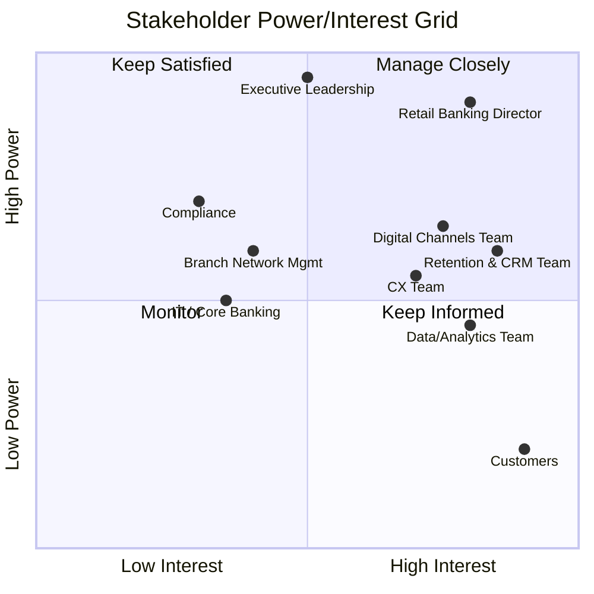

# 02. Stakeholder Analysis

## Stakeholder Register

| ID | Stakeholder | Role | Interest / Stake |
|---|---|---|---|
| S1 | Retail Banking Director | Executive sponsor | Owns churn/retention as a P&L outcome |
| S2 | Retention & CRM Team | Business owner | Executes retention campaigns, needs risk scoring |
| S3 | Digital Channels / Product Team | Business owner | Owns mobile app, engagement features |
| S4 | Customer Experience (CX) Team | Business owner | Owns NPS, complaint handling |
| S5 | Branch Network Management | Business owner | Manages branch footprint, in-person service |
| S6 | Data/Analytics Team | Delivery | Builds and maintains churn model & dashboard |
| S7 | IT / Core Banking Team | Delivery | Provides data access, system integration |
| S8 | Compliance & Data Privacy | Governance | Ensures data use meets regulatory requirements |
| S9 | Existing Customers | End beneficiary | Wants convenience, trust, low friction |
| S10 | Executive Leadership | Sponsor | Competitive positioning vs. fintech entrants |

## Power / Interest Grid

**Interpretation:**
- **Manage Closely** (high power, high interest): Retail Banking Director,
  Retention & CRM Team, Digital Channels Team — primary decision-makers and
  day-to-day owners of the retention effort.
- **Keep Satisfied** (high power, lower day-to-day interest): Executive
  Leadership, Compliance — need periodic updates and sign-off, not daily involvement.
- **Keep Informed** (high interest, lower power): Customers, CX Team —
  directly affected by outcomes but not decision-makers on strategy.
- **Monitor**: IT/Core Banking, Branch Network Management — supporting
  roles, engaged as needed.

## RACI Matrix

| Activity | Retail Banking Dir. | Retention/CRM | Digital/Product | CX Team | Data/Analytics | IT | Compliance |
|---|---|---|---|---|---|---|---|
| Define business problem & scope | A | R | C | C | C | I | I |
| Stakeholder & process analysis (BA) | A | R | C | C | I | I | I |
| Data collection & churn modeling | I | C | I | I | R/A | C | C |
| Dashboard design & build | I | C | C | I | R/A | C | I |
| Requirements definition | A | R | R | R | C | C | I |
| Business rules approval | A | C | I | I | I | I | R |
| Retention campaign execution | I | R/A | C | C | I | I | I |
| KPI tracking & reporting | A | R | I | R | R | I | I |
| Data privacy / compliance sign-off | I | I | I | I | C | C | R/A |

*R = Responsible, A = Accountable, C = Consulted, I = Informed*

## Key Stakeholder Needs Summary

| Stakeholder | Primary Need from This Project |
|---|---|
| Retail Banking Director | A clear, quantified view of churn risk and expected impact of interventions |
| Retention & CRM Team | A prioritized, actionable list of at-risk customers |
| Digital Channels Team | Evidence on which engagement features most reduce churn |
| CX Team | Visibility into how service friction (complaints, calls) drives attrition |
| Branch Network Mgmt | Understanding of how branch dependency correlates with risk |
| Data/Analytics Team | A reproducible, documented modeling and data pipeline |
| Compliance | Assurance that any real deployment addresses data privacy |
