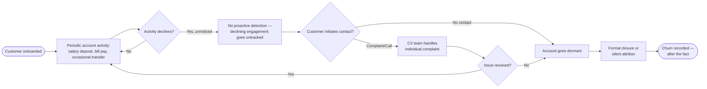

# 04. As-Is Process & BPMN

## Current-State Overview

Today, ABB's approach to churn is largely **reactive**: attrition is
identified only after a customer has already reduced activity to near-zero
or formally closed an account/product. There is no systematic, cross-team
process for detecting early disengagement signals.

## As-Is Process Map (Simplified BPMN)

## Pain Points Identified

| # | Pain Point | Impact |
|---|---|---|
| P1 | No engagement-based early-warning signal — churn is detected only via account closure or complaint | Retention team acts too late to intervene |
| P2 | CX and Retention teams handle complaints/attrition individually, not as a segmented risk population | No systematic prioritization of at-risk customers |
| P3 | Digital engagement data (app logins, branch visits) is not connected to a churn-risk score | Valuable leading indicators go unused |
| P4 | No visibility into customers who are also active on a competitor platform (dual-usage) | Competitive leakage is invisible until the customer fully switches |
| P5 | Branch-first customers with declining branch visits are not flagged, since branch visit drop-off isn't monitored as a KPI | Slower-moving churn (dormancy) is the hardest to catch and most common |
| P6 | Retention outreach, when it happens, is generic rather than driver-specific (e.g., same offer regardless of whether the driver is service friction vs. low engagement) | Lower effectiveness of retention campaigns |

## Root-Cause Summary

The As-Is process treats churn as an **event** (account closure) rather than
a **trend** (declining engagement, dropping NPS, rising service friction).
This is the core gap the To-Be process (see `07_to_be_process_and_solution.md`)
is designed to close.
