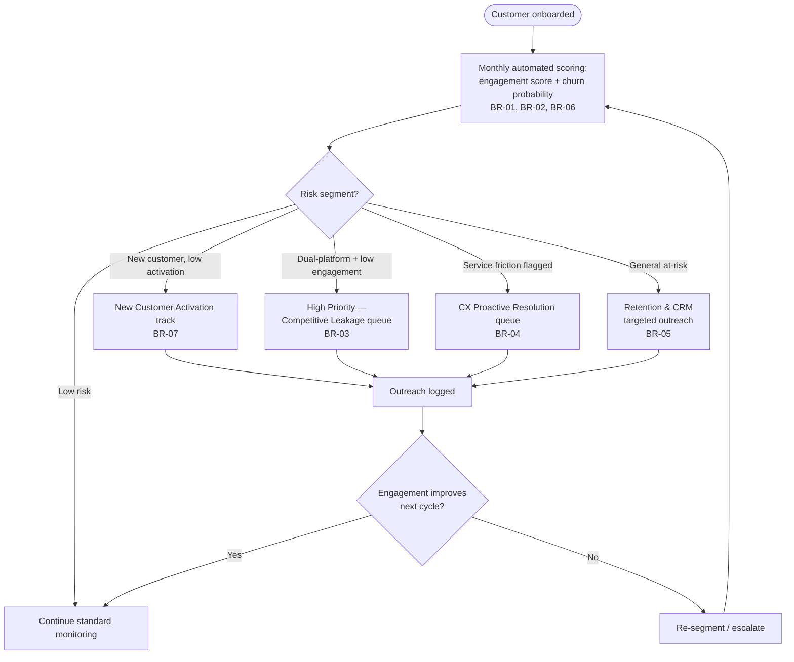
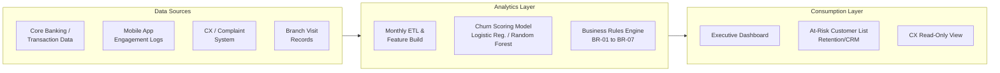

# 07. To-Be Process & Solution

## Target-State Vision

Shift ABB's churn management from **reactive** (detecting attrition after
it happens) to **proactive** (detecting declining engagement and
intervening before churn occurs) — closing the gap with fintech competitors
like m10, whose fully digital model makes engagement drop-off visible
almost immediately.

## To-Be Process Map

## As-Is vs To-Be Comparison

| Dimension | As-Is | To-Be |
|---|---|---|
| Detection trigger | Account closure or customer-initiated complaint | Monthly engagement + churn-probability scoring (leading indicator) |
| Data used | None systematically — ad hoc complaint records | Behavior, engagement, experience, and competitive-exposure data |
| Segmentation | None — customers handled individually as they contact ABB | Rule-based segments: New Activation, Competitive Leakage, Service Friction, General At-Risk |
| Ownership | CX team handles complaints in isolation | Cross-functional: Retention/CRM, CX, Digital, Data/Analytics (see RACI) |
| Outreach | Reactive, generic | Proactive, driver-specific, frequency-controlled (BR-05) |
| Visibility | No dashboard; churn known only in hindsight | Monthly-refreshed dashboard (see `03_data_and_dashboard.md`) |
| Feedback loop | None | Outreach outcomes logged and fed back into re-segmentation (FR-07) |

## Target Solution Architecture

## Key Design Decisions

1. **Monthly batch scoring**, not real-time — matches the analytical
   maturity of the current data landscape and avoids core-system load
   (NFR-03).
2. **Rule-based segmentation on top of a statistical model** — keeps the
   system explainable to non-technical business users (NFR-08) while still
   leveraging the predictive model's ranking power.
3. **Cross-functional ownership** — no single team can act on all churn
   drivers alone; the To-Be process explicitly routes segments to the team
   best positioned to act (Retention, CX, or Digital/Product).
